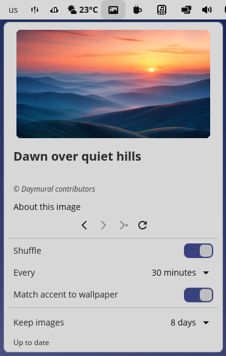

# Daymural

A native COSMIC panel applet that brings Microsoft Bing's daily UHD image to
your desktop.



Daymural downloads the latest wallpaper, applies it through COSMIC, and keeps a
local history that you can browse from the panel. It can also:

- shuffle downloaded wallpapers on a timer;
- keep 3, 8, or 30 days of images, or keep them forever;
- match COSMIC's accent colour to the current wallpaper;
- preserve a wallpaper or accent colour you selected in COSMIC Settings

## Install

Daymural is not published in the COSMIC Store yet. From a source checkout, you
can build and install the Flatpak locally. This is the recommended installation
method.

Existing users: follow [the data-preserving cosmic-ext upgrade](docs/installation.md#upgrading-to-the-cosmic-ext-identity)
before installing. The public ID is `io.github.ercling.cosmic-ext-applet-daymural`;
the retained storage ID is `io.github.ercling.cosmic-applet-daymural`. Native data
stays in place; Flatpak private history and thumbnails need a host-side transfer
before first launch. Shared settings and accent recovery records need no transfer.
Remove the old panel entry and re-add Daymural after installation.

### Build and install locally with Flatpak

You need `flatpak-builder`, [`uv`](https://docs.astral.sh/uv/), `appstreamcli`,
and [`just`](https://github.com/casey/just). Add a user-scoped Flathub remote
once if it is not already configured:

```bash
flatpak remote-add --user --if-not-exists flathub \
  https://flathub.org/repo/flathub.flatpakrepo
```

Then generate the vendored Cargo source list, build the Flatpak, and install it
for the current user:

```bash
just flatpak-sources
just flatpak-install
```

Restart `cosmic-panel` or log out and back in, then add **Daymural** in
**COSMIC Settings → Desktop → Panel → Configure panel applets**.

To uninstall the local Flatpak:

```bash
just flatpak-uninstall
```

### Native installation

A per-user native installation remains available as an alternative.

See [Installation](docs/installation.md) for prerequisite packages,
uninstalling, native installation, data locations, and distribution-specific
details.

## Important notes

- Bing images are fetched directly from Microsoft and remain the property of
  their respective rightsholders. Use them only as personal, noncommercial
  wallpaper unless the rightsholder grants broader permission. See
  [Image rights and attribution](docs/image-rights.md).
- Do not run native and Flatpak installations at the same time. Their separate
  applet instances can both modify the shared wallpaper and COSMIC settings.
- If **Match accent to wallpaper** is enabled, switch it off before uninstalling
  if you want Daymural to restore your previous accent automatically.
- See [Known limitations](docs/limitations.md) for current COSMIC and libcosmic
  integration issues.

Daymural is an unofficial, independent project. It is not affiliated with,
authorized by, sponsored by, or endorsed by Microsoft.

## Development and contributing

Use the repository `justfile` for development:

```bash
just build
just check   # formatting, Clippy with warnings denied, and all tests
```

Run `just check` before submitting a change. Contributions are welcome,
especially native-speaker corrections to the Fluent translations under
`i18n/`. Read [Contributing](CONTRIBUTING.md) for the development workflow,
testing rules, translation requirements, and architecture references.

## License

Daymural's code and project-owned assets are licensed under
[GPL-3.0-only](LICENSE). This license does not cover photographs downloaded
from Bing.
